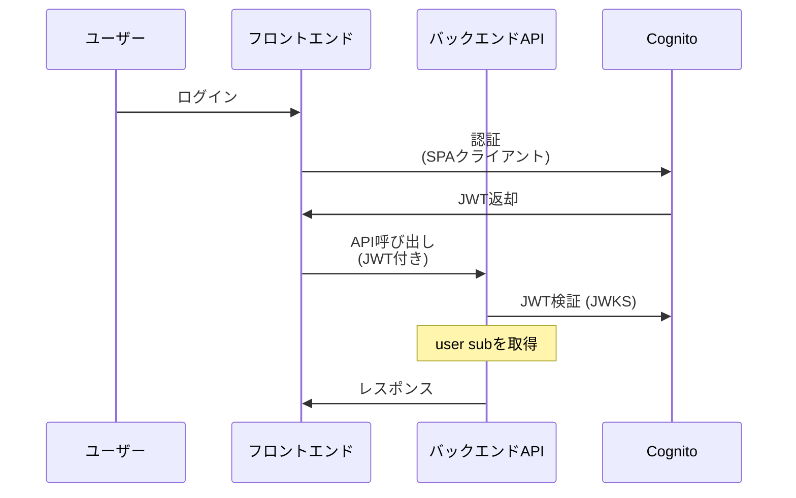

# Cognito User Pool Terraform Module

フロントエンド=SPA
バックエンド=一般的なAPIサーバ
を想定

### 認証フローイメージ

```mermaid
sequenceDiagram
    participant User as ユーザー
    participant Frontend as フロントエンド
    participant Backend as バックエンドAPI
    participant Cognito as Cognito

    User->>Frontend: ログイン
    Frontend->>Cognito: 認証<br/>(SPAクライアント)
    Cognito->>Frontend: JWT返却
    Frontend->>Backend: API呼び出し<br/>(JWT付き)
    Backend->>Cognito: JWT検証 (JWKS)
    Note over Backend: user subを取得
    Backend->>Frontend: レスポンス
```